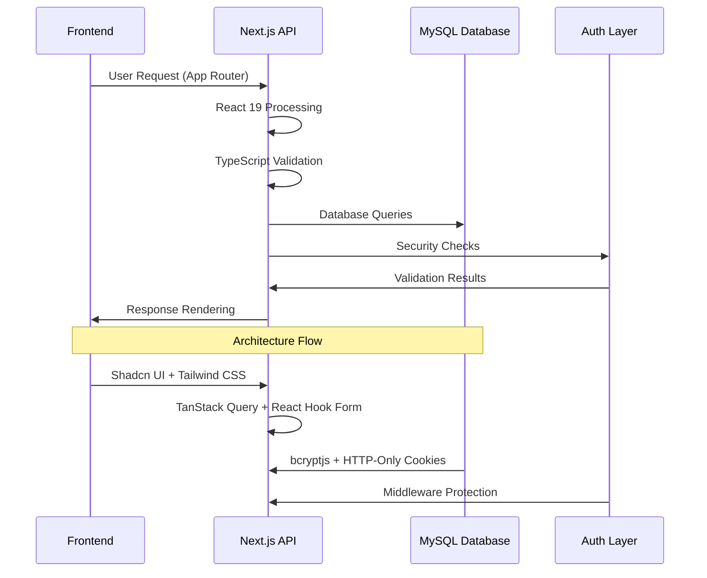
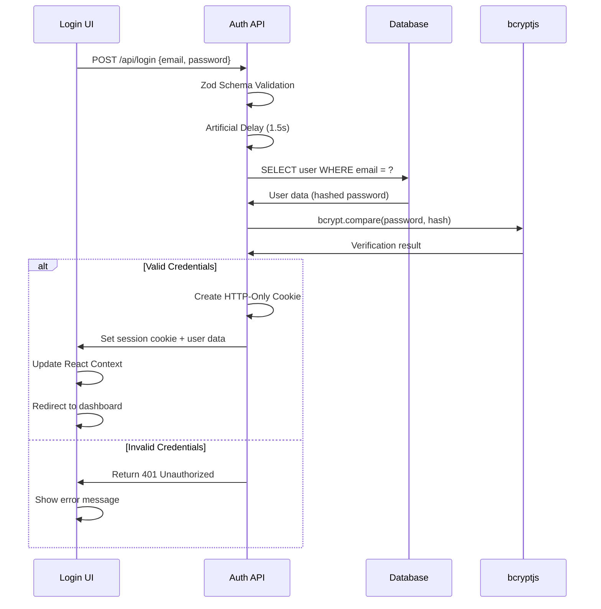
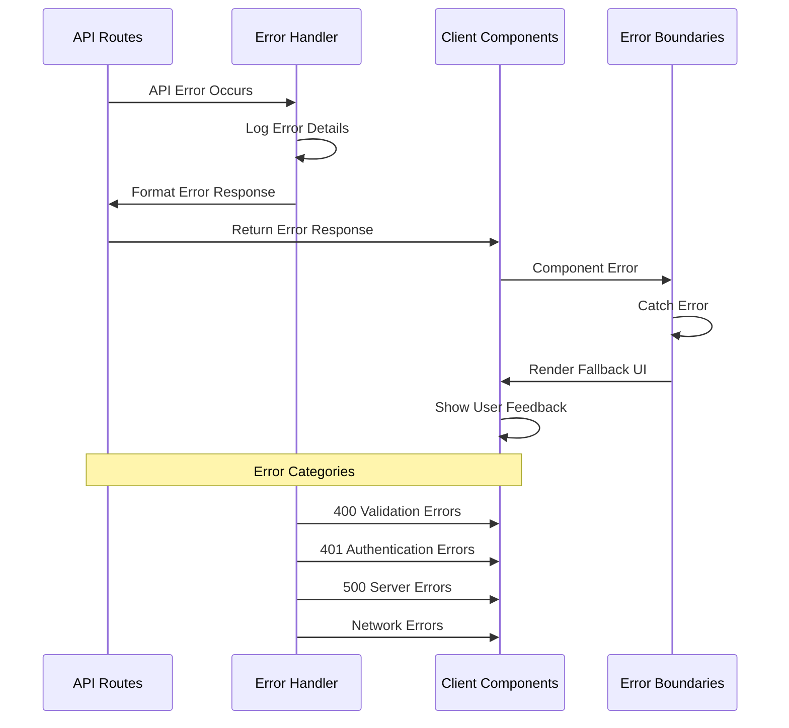
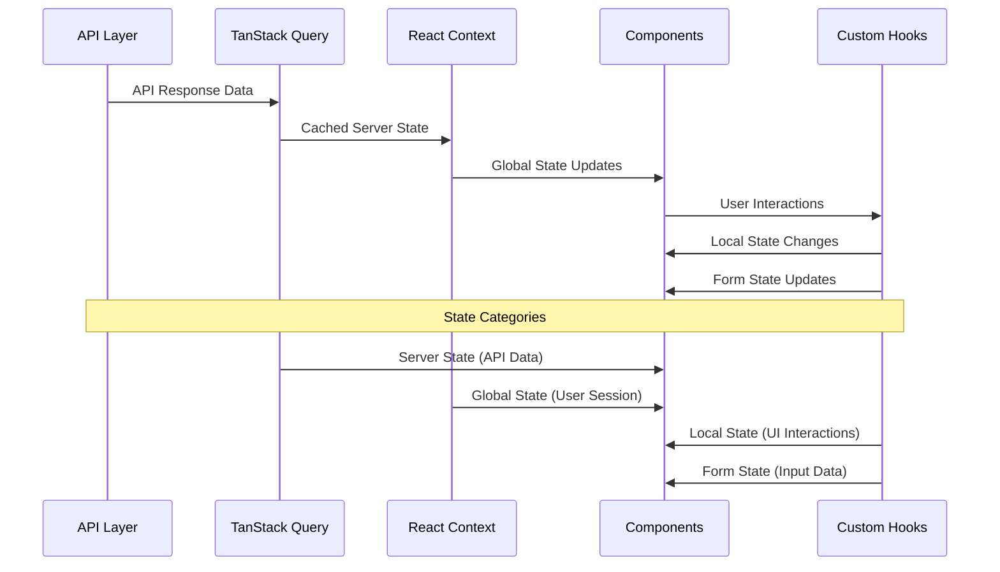
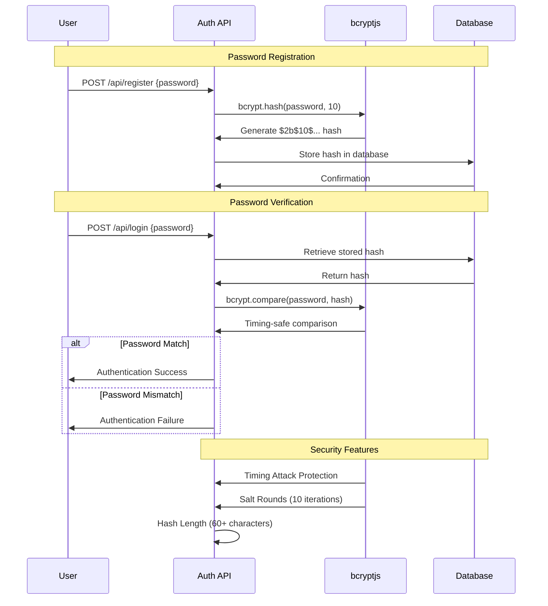
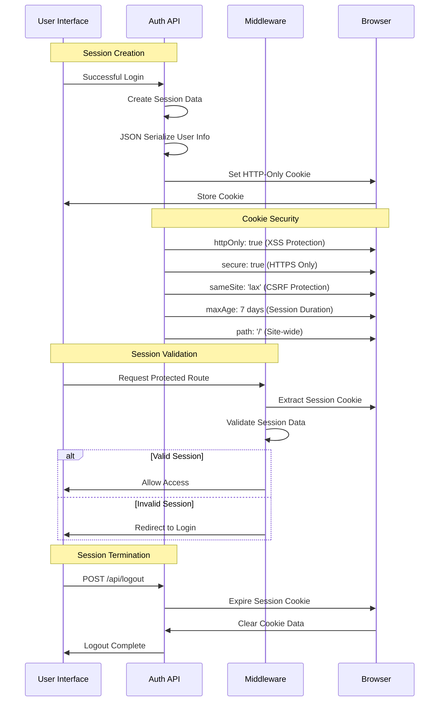
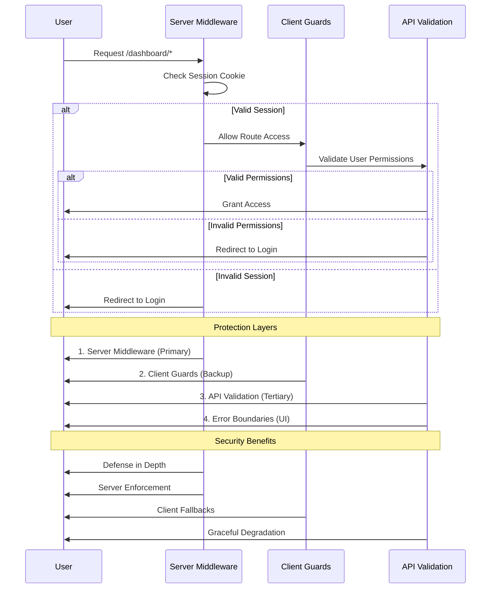
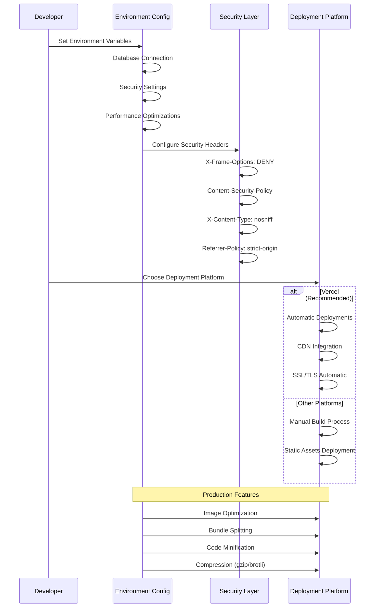

# Carbon Footprint Tracker - Technical Documentation

## Table of Contents

### **Core Documentation**
- [Overview](#overview)
- [Tech Stack](#tech-stack)
  - [Core Framework & Runtime](#core-framework--runtime)
  - [Frontend Technologies](#frontend-technologies)
  - [Backend & Database](#backend--database)
  - [Development & Build Tools](#development--build-tools)
  - [Production & Deployment](#production--deployment)

### **Architecture & Implementation**
- [Application Architecture](#application-architecture)
  - [High-Level Architecture](#high-level-architecture)
  - [File Structure Organization](#file-structure-organization)
- [Authentication System](#authentication-system)
  - [Authentication Flow](#authentication-flow)
  - [Security Implementation](#security-implementation)
  - [Security Flow Details](#security-flow-details)
- [Core Functions & Implementation](#core-functions--implementation)
  - [User Registration (`/api/register`)](#1-user-registration-apiregister)
  - [User Authentication (`/api/login`)](#2-user-authentication-apilogin)
  - [Session Management (`/api/me`)](#3-session-management-apime)
  - [User Logout (`/api/logout`)](#4-user-logout-apilogout)

### **System Design**
- [Error Handling System](#error-handling-system)
  - [Error Handling Architecture](#error-handling-architecture)
  - [API Error Handling](#api-error-handling)
  - [Client-Side Error Handling](#client-side-error-handling)
- [Database Design](#database-design)
  - [Users Table Schema](#users-table-schema)
  - [Security Features](#security-features)
  - [Connection Pooling](#connection-pooling)
- [Component Architecture](#component-architecture)
  - [Component Categories](#component-categories)
  - [State Management Flow](#state-management-flow)

### **Security & Performance**
- [Security Analysis](#security-analysis)
  - [Authentication Security](#authentication-security)
  - [Input Validation Security](#input-validation-security)
  - [Attack Prevention](#attack-prevention)
- [Performance Optimizations](#performance-optimizations)
  - [Frontend Performance](#frontend-performance)
  - [Backend Performance](#backend-performance)

### **Deployment & Production**
- [Deployment & Production](#deployment--production)
  - [Production Configuration](#production-configuration)
  - [Monitoring & Logging](#monitoring--logging)

### **Summary**
- [Conclusion](#conclusion)
  - [Security Excellence](#security-excellence)
  - [Performance Optimization](#performance-optimization)
  - [Developer Experience](#developer-experience)

---

## Overview

The Carbon Footprint Tracker (EcoTracker) is a modern web application built with Next.js 15 and React 19 that enables users to track, analyze, and reduce their environmental impact. This document provides comprehensive technical documentation including architecture, security analysis, and implementation details.

---

## Tech Stack

### Core Framework & Runtime
```
Next.js 15.1+ (App Router)
├── React 19 (Concurrent Features)
├── TypeScript 5.6+
├── Node.js 18+ (Runtime)
└── Bun (Package Manager & Runtime)
```

### Frontend Technologies
```
UI Framework:
├── Shadcn UI v2 (Component Library)
├── Tailwind CSS 3.4+ (Styling)
├── Radix UI (Primitive Components)
├── Lucide React (Icons)
└── Framer Motion (Animations)

State Management:
├── TanStack Query (Server State)
├── React Context (Client State)
└── React Hooks (Local State)

Form Handling:
├── React Hook Form (Form Management)
└── Zod (Schema Validation)
```

### Backend & Database
```
API Layer:
├── Next.js API Routes (RESTful APIs)
├── MySQL 8.0+ (Relational Database)
└── mysql2 (Database Driver)

Authentication:
├── bcryptjs (Password Hashing)
├── HTTP-Only Cookies (Session Management)
└── Middleware (Route Protection)
```

### Development & Build Tools
```
Development:
├── ESLint (Code Linting)
├── Prettier (Code Formatting)
├── TypeScript (Type Checking)
└── Bun Test (Testing)

Performance:
├── Turbopack (Fast Development)
├── Bundle Analyzer (Optimization)
└── Next.js Optimizations
```

### Production & Deployment
```
Deployment:
├── Vercel (Recommended)
├── Environment Variables
├── Security Headers
└── Performance Optimization
```

---

## Application Architecture

### High-Level Architecture



### File Structure Organization

```
carbonfootprint/
├── app/                           # Next.js App Router
│   ├── api/                       # API Routes
│   │   ├── login/route.ts         # Authentication endpoint
│   │   ├── register/route.ts      # User registration
│   │   ├── logout/route.ts        # Session termination
│   │   └── me/route.ts            # User session check
│   ├── dashboard/                 # Protected dashboard routes
│   ├── layout.tsx                 # Root layout component
│   └── page.tsx                   # Landing page
├── components/                    # Reusable UI components
│   ├── ui/                        # Shadcn UI components
│   ├── forms/                     # Form components
│   └── common/                    # Shared utilities
├── lib/                          # Utility libraries
│   ├── db.ts                     # Database connection
│   ├── utils.ts                  # Helper functions
│   └── validations.ts            # Zod schemas
├── contexts/                     # React contexts
├── hooks/                        # Custom hooks
└── middleware.ts                 # Route protection
```

---

## Authentication System

### Authentication Flow



### Security Implementation

#### 1. Password Security
- **bcryptjs hashing** with salt rounds (10 rounds)
- **Password length validation** (8-72 characters)
- **Hash comparison** using timing-safe bcrypt.compare()

#### 2. Session Management
- **HTTP-Only cookies** prevent XSS attacks
- **Secure flag** in production (HTTPS only)
- **SameSite=Lax** prevents CSRF attacks
- **7-day expiration** with automatic cleanup

#### 3. Route Protection
- **Middleware protection** for dashboard routes
- **Client-side guards** as backup protection
- **Session validation** on every protected request

### Security Flow Details

```
User Login Process:

1. User submits email/password via POST /api/login
2. Input validation with Zod schema
3. Artificial 1.5s delay (anti-brute force)
4. Database query for user credentials
5. bcryptjs password verification
6. Session cookie creation (HTTP-only, secure)
7. Client state update and redirect

Session Validation:

1. Protected route access attempt
2. Middleware checks session cookie
3. GET /api/me validates session data
4. Client context manages authentication state
5. Failed validation redirects to login
```

---

## Core Functions & Implementation

### 1. User Registration (`/api/register`)

```typescript
POST /api/register
Content-Type: application/json

{
  "name": "John Doe",
  "email": "john@example.com",
  "password": "securePassword123"
}
```

**Process Flow:**
1. **Input Validation**: Zod schema validates name (2-100 chars), email format, password (8-72 chars)
2. **Duplicate Check**: Query database for existing email
3. **Password Hashing**: bcrypt.hash() with 10 salt rounds
4. **User Creation**: Insert into MySQL users table
5. **Response**: Return user data (201 status)

**Security Features:**
- Email uniqueness enforcement
- Password hashing before storage
- Artificial 1.8s delay to prevent user enumeration
- SQL injection prevention via parameterized queries

### 2. User Authentication (`/api/login`)

```typescript
POST /api/login
Content-Type: application/json

{
  "email": "john@example.com",
  "password": "securePassword123"
}
```

**Process Flow:**
1. **Input Validation**: Validate email format and password presence
2. **User Lookup**: Query database by email with LIMIT 1
3. **Password Verification**: bcrypt.compare() timing-safe comparison
4. **Session Creation**: Set HTTP-only cookie with user data
5. **Response**: Return user info (200 status) or error (401)

**Security Features:**
- Timing attack protection via artificial delay
- Generic error messages (no user enumeration)
- HTTP-only, secure cookies
- No sensitive data in response

### 3. Session Management (`/api/me`)

```typescript
GET /api/me
```

**Process Flow:**
1. **Cookie Extraction**: Parse session cookie
2. **Data Validation**: JSON.parse with error handling
3. **Response**: Return user data or null

**Security Features:**
- No database queries (stateless)
- Cookie parsing error handling
- Cache control headers (no-store)

### 4. User Logout (`/api/logout`)

```typescript
POST /api/logout
```

**Process Flow:**
1. **Cookie Deletion**: Set expired cookies
2. **State Cleanup**: Clear all auth-related cookies
3. **Response**: Success confirmation

**Security Features:**
- Multiple cookie deletion for comprehensive cleanup
- Keepalive request to ensure delivery
- Cache-busting headers

---

## Error Handling System

### Error Handling Architecture



### API Error Handling

#### 1. Structured Error Responses
```typescript
// Successful response
{
  "id": 123,
  "name": "John Doe",
  "email": "john@example.com"
}

// Error response
{
  "error": "Invalid credentials",
  "details": {
    "email": ["Invalid email"],
    "password": ["Too short"]
  }
}
```

#### 2. HTTP Status Codes
- **200**: Success
- **201**: Created (registration)
- **400**: Bad Request (validation errors)
- **401**: Unauthorized (invalid credentials)
- **409**: Conflict (duplicate email)
- **500**: Internal Server Error

#### 3. Error Categories

**Validation Errors (400):**
- Zod schema validation failures
- Required fields missing
- Invalid data formats

**Authentication Errors (401):**
- Invalid credentials
- Missing or expired sessions
- Unauthorized access attempts

**Server Errors (500):**
- Database connection failures
- Unexpected exceptions
- Third-party service failures

### Client-Side Error Handling

#### 1. Error Boundaries
```typescript
// React Error Boundary for UI errors
class ErrorBoundary extends React.Component {
  constructor(props) {
    super(props);
    this.state = { hasError: false };
  }

  static getDerivedStateFromError(error) {
    return { hasError: true };
  }

  componentDidCatch(error, errorInfo) {
    console.error('UI Error:', error, errorInfo);
  }

  render() {
    if (this.state.hasError) {
      return <ErrorFallback />;
    }
    return this.props.children;
  }
}
```

#### 2. Loading States
```typescript
// Comprehensive loading management
const { isLoading, error, retry } = useDashboardLoading();

if (isLoading) {
  return <FullScreenLoading isVisible={true} variant="login" />;
}

if (error) {
  return (
    <ErrorDisplay
      message={error}
      onRetry={retry}
      showContactSupport={true}
    />
  );
}
```

#### 3. Network Error Handling
```typescript
// Retry logic with exponential backoff
const retry = async (fn, maxAttempts = 3) => {
  for (let attempt = 1; attempt <= maxAttempts; attempt++) {
    try {
      return await fn();
    } catch (error) {
      if (attempt === maxAttempts) throw error;
      await sleep(1000 * Math.pow(2, attempt - 1));
    }
  }
};
```

---

## Database Design

### Users Table Schema
```sql
CREATE TABLE users (
  id INT AUTO_INCREMENT PRIMARY KEY,
  name VARCHAR(100) NOT NULL,
  email VARCHAR(255) NOT NULL UNIQUE,
  password_hash VARCHAR(255) NOT NULL,
  created_at TIMESTAMP DEFAULT CURRENT_TIMESTAMP,
  INDEX idx_email (email),
  INDEX idx_created_at (created_at)
) ENGINE=InnoDB DEFAULT CHARSET=utf8mb4;
```

### Security Features
- **UNIQUE constraint** on email prevents duplicates
- **Password hashing** before storage
- **Indexed fields** for query optimization
- **UTF8MB4 charset** for international character support

### Connection Pooling
```typescript
// Configurable connection pool
const pool = mysql.createPool({
  host: process.env.MYSQL_HOST,
  port: parseInt(process.env.MYSQL_PORT || '3306'),
  user: process.env.MYSQL_USER,
  password: process.env.MYSQL_PASSWORD,
  database: process.env.MYSQL_DATABASE,
  connectionLimit: 10,
  namedPlaceholders: true,
});
```

---

## Component Architecture

### Component Categories

#### 1. UI Components (`/components/ui/`)
- **Base Components**: Button, Input, Card, Dialog
- **Layout Components**: Sidebar, Header, Navigation
- **Data Display**: Table, Chart, Cards
- **Feedback**: Loading, Toast, Error states

#### 2. Form Components (`/components/forms/`)
- **Authentication Forms**: Login, Registration
- **Data Input Forms**: Carbon footprint entry
- **Validation**: Real-time Zod validation

#### 3. Layout Components
- **App Layout**: Main application structure
- **Dashboard Layout**: Protected area layout
- **Responsive Design**: Mobile-first approach

### State Management Flow



---

## Security Analysis

### Authentication Security

#### 1. Password Security



**Security Measures:**
- **bcryptjs** with 10 salt rounds (industry standard)
- **Timing-safe comparison** prevents timing attacks
- **Password length limits** (8-72 characters)
- **Hash storage only** (no plaintext passwords)

#### 2. Session Security



**Security Features:**
- **HTTP-only cookies** inaccessible to JavaScript
- **Secure flag** in production environments
- **SameSite protection** against CSRF attacks
- **Automatic expiration** after 7 days

#### 3. Route Protection



**Security Benefits:**
- **Defense in depth** with multiple validation layers
- **Server-side enforcement** cannot be bypassed
- **Client-side fallbacks** for better UX

### Input Validation Security

#### 1. Server-Side Validation
```typescript
// Zod schema validation
const registerSchema = z.object({
  name: z.string().min(2).max(100),
  email: z.string().email().max(255),
  password: z.string().min(8).max(72)
}).strict();
```

**Benefits:**
- **Type-safe validation** with TypeScript inference
- **Runtime safety** prevents invalid data processing
- **Consistent validation** across all endpoints

#### 2. SQL Injection Prevention
```typescript
// Parameterized queries only
const [rows] = await pool.query(
  'SELECT * FROM users WHERE email = ? LIMIT 1',
  [email]  // Parameter binding
);
```

**Security Features:**
- **Parameterized queries** prevent injection attacks
- **Input sanitization** through validation schemas
- **LIMIT clauses** prevent data dumping

### Attack Prevention

#### 1. Brute Force Protection
```typescript
// Artificial delays
await sleep(1500);  // Login delay
await sleep(1800);  // Registration delay
```

**Protection:**
- **Rate limiting** via artificial delays
- **Timing attack prevention** with consistent response times
- **Resource exhaustion protection** through delays

#### 2. User Enumeration Prevention
```typescript
// Generic error messages
if (rows.length === 0) {
  return NextResponse.json(
    { error: 'Invalid credentials' },  // Same for missing/invalid
    { status: 401 }
  );
}
```

**Security:**
- **No user enumeration** through error messages
- **Consistent response times** for all authentication failures
- **Generic error handling** prevents information leakage

---

## Performance Optimizations

### Frontend Performance

#### 1. Code Splitting & Loading
```
App Structure:
├── Server Components (default)
├── Client Components (interactive only)
├── Dynamic Imports (lazy loading)
└── Suspense Boundaries (streaming)
```

#### 2. Caching Strategy
```
Cache Types:
├── Browser Cache (static assets)
├── Service Worker (offline support)
├── TanStack Query (API responses)
└── HTTP Cache (CDN optimization)
```

#### 3. Bundle Optimization
```
Optimization Techniques:
├── Tree Shaking (unused code removal)
├── Dead Code Elimination (bundle size)
├── Image Optimization (Next.js Image)
└── CSS Purging (Tailwind CSS)
```

### Backend Performance

#### 1. Database Optimization
```
Query Optimization:
├── Connection Pooling (10 connections)
├── Indexed Fields (email, created_at)
├── LIMIT Clauses (resource limits)
└── Prepared Statements (performance)
```

#### 2. API Optimization
```
Performance Features:
├── Artificial Delays (security vs performance trade-off)
├── HTTP Cache Headers (no-store for auth)
├── Request Deduplication (TanStack Query)
└── Error Boundary Optimization
```

---

## Deployment & Production

### Production Configuration



#### 1. Environment Variables
```bash
# Database
MYSQL_HOST=production-db.example.com
MYSQL_PORT=3306
MYSQL_USER=ecotracker_user
MYSQL_PASSWORD=secure_password
MYSQL_DATABASE=ecotracker_prod

# Security
NODE_ENV=production
NEXTAUTH_SECRET=production_secret_key
```

#### 2. Security Headers
```typescript
// Next.js configuration
const securityHeaders = [
  {
    key: 'X-Frame-Options',
    value: 'DENY'
  },
  {
    key: 'X-Content-Type-Options',
    value: 'nosniff'
  },
  {
    key: 'Referrer-Policy',
    value: 'strict-origin-when-cross-origin'
  }
];
```

#### 3. Performance Optimization
```
Production Optimizations:
├── Static Generation (SSG)
├── Image Optimization
├── Bundle Splitting
├── CDN Integration
└── Compression (gzip/brotli)
```

### Monitoring & Logging

#### 1. Error Tracking
```typescript
// Comprehensive error logging
console.error('Login error', error);
console.error('Registration error', error);
console.error('Logout error:', error);
```

#### 2. Performance Monitoring
```
Monitoring Points:
├── API Response Times
├── Database Query Performance
├── Frontend Rendering Metrics
└── User Interaction Analytics
```

---

## Conclusion

The Carbon Footprint Tracker demonstrates modern web application architecture with a focus on security, performance, and user experience. Key strengths include:

### Security Excellence
- **Multi-layer authentication** with bcryptjs hashing
- **HTTP-only session cookies** preventing XSS attacks
- **Comprehensive input validation** with Zod schemas
- **SQL injection prevention** through parameterized queries
- **Brute force protection** via artificial delays

### Performance Optimization
- **Next.js 15** with latest React 19 concurrent features
- **Shadcn UI v2** for consistent, accessible components
- **TanStack Query** for efficient server state management
- **Tailwind CSS 3.4+** for optimized styling

### Developer Experience
- **TypeScript 5.6+** with strict type checking
- **Modern development tools** (Bun, Turbopack)
- **Component reusability** through Shadcn UI
- **Comprehensive error handling** and user feedback

This application represents a production-ready solution for carbon footprint tracking with enterprise-level security and performance considerations.
