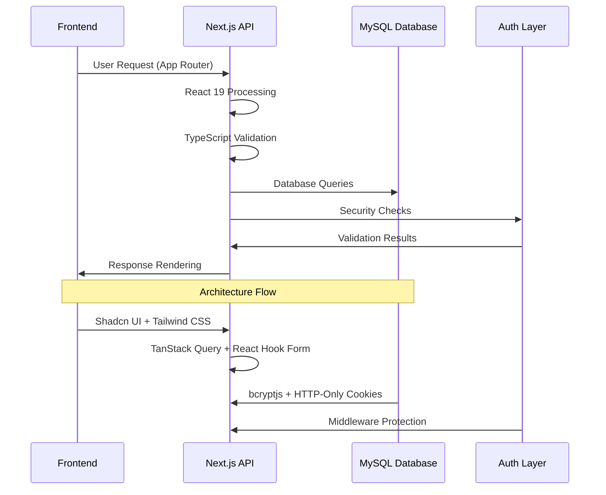
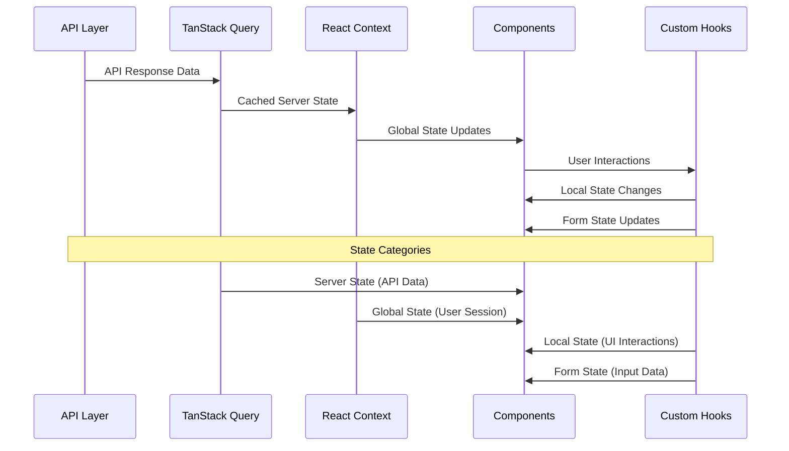
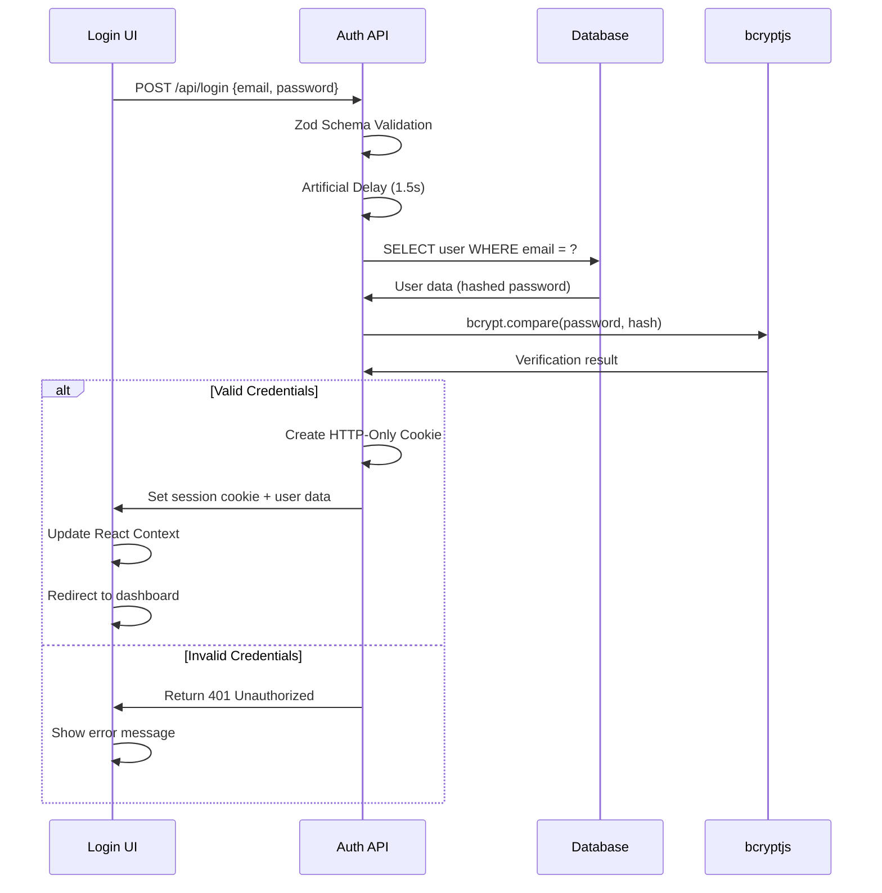
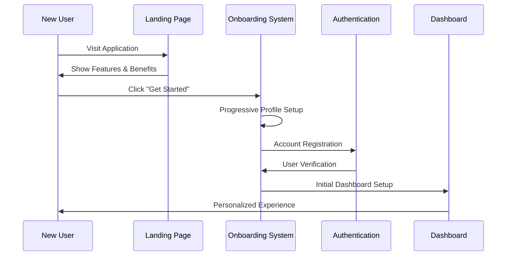
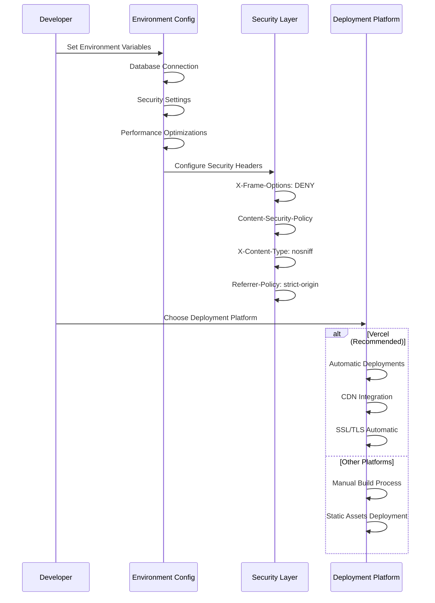
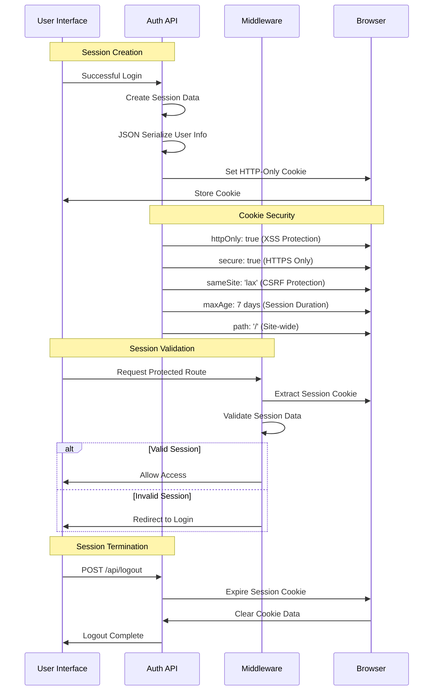
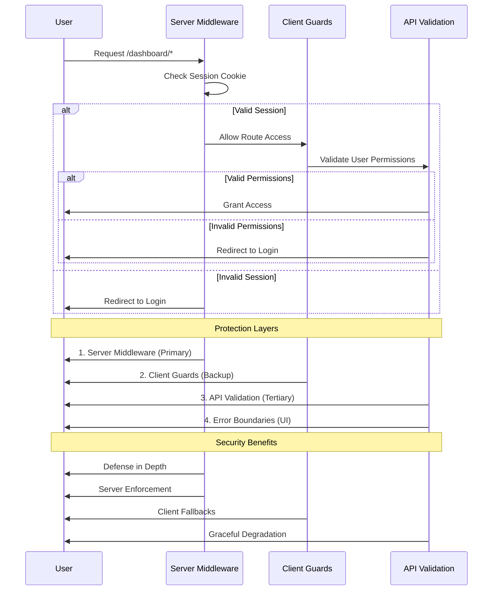
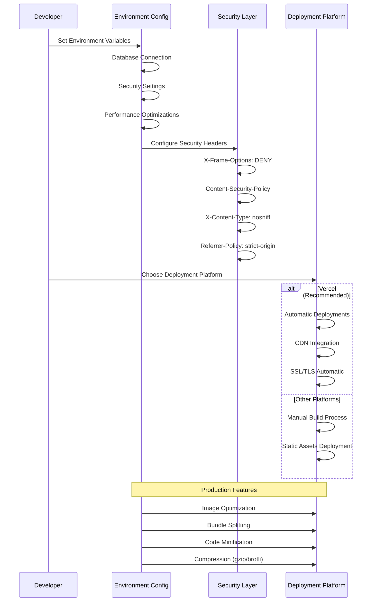

# Carbon Footprint Tracker - Technical Documentation

## Table of Contents

### Overview & Getting Started
- [Project Overview](#project-overview)
- [Technology Stack](#technology-stack)
- [Architecture Overview](#architecture-overview)

### Core Architecture
- [Application Architecture](#application-architecture)
- [File Structure](#file-structure)
- [Component Architecture](#component-architecture)
- [State Management](#state-management)

### Authentication & Security
- [Authentication System](#authentication-system)
  - [Security Implementation](#security-implementation)
- [Database Design](#database-design)

### Core Features
- [API Endpoints](#api-endpoints)
- [Error Handling](#error-handling)
- [User Onboarding](#user-onboarding)

### Performance & Deployment
  - [Performance Optimization](#performance-optimization)
- [Deployment Guide](#deployment-guide)

### Reference
- [Environment Configuration](#environment-configuration)
- [Development Workflow](#development-workflow)

---

## Overview & Getting Started

### Project Overview

The **Carbon Footprint Tracker** (EcoTracker) is a modern web application built with Next.js 15 and React 19 that enables users to track, analyze, and reduce their environmental impact.

**Key Features:**
- Carbon footprint tracking and analysis
- Interactive dashboards and data visualization
- Secure user authentication and session management
- Responsive design with modern UI components
- High-performance architecture with server-side rendering

**Target Users:**
- Environmentally conscious individuals
- Sustainability researchers
- Organizations tracking carbon emissions
- Educational institutions teaching environmental science

---

## Quick Start

### Prerequisites
- Node.js 18+
- MySQL 8.0+
- Bun package manager

### Installation
```bash
# Clone the repository
git clone <repository-url>
cd carbonfootprint

# Install dependencies
bun install

# Set up environment variables
cp .env.example .env.local

# Initialize database
bun run scripts:init-db

# Start development server
bun run dev
```

### Key Development Commands
```bash
bun run dev              # Start development server
bun run dev --turbo      # Start with Turbopack (faster)
bun run build            # Build for production
bun run lint             # Run linting
bun run type-check       # TypeScript checking
```

---

## Documentation Navigation

This documentation is organized to follow your development journey:

1. **Overview** → Get familiar with the project
2. **Architecture** → Understand the system design
3. **Security** → Learn about authentication and protection
4. **Features** → Explore core functionality
5. **Performance** → Discover optimization strategies
6. **Reference** → Access configuration and workflow details

---

## Technology Stack

### Core Framework & Runtime
```
Next.js 15.1+ (App Router)
├── React 19 (Concurrent Features)
├── TypeScript 5.6+ (Strict Mode)
├── Node.js 18+ (Runtime)
└── Bun (Package Manager & Runtime)
```

### Frontend Technologies
```
UI Framework:
├── Shadcn UI v2 (Component Library)
├── Tailwind CSS 3.4+ (Utility-First)
├── Radix UI (Accessible Primitives)
├── Lucide React (Modern Icons)
└── Framer Motion (Animations)

State Management:
├── TanStack Query (Server State)
├── React Context (Global State)
└── React Hooks (Local State)

Form Handling:
├── React Hook Form (Performance)
└── Zod (Runtime Validation)
```

### Backend & Database
```
API Layer:
├── Next.js API Routes (RESTful)
├── MySQL 8.0+ (Relational DB)
└── mysql2 (Type-Safe Driver)

Authentication:
├── bcryptjs (Secure Hashing)
├── HTTP-Only Cookies (XSS Protection)
└── Middleware (Route Protection)
```

### Development & Build Tools
```
Development:
├── ESLint (Code Quality)
├── Prettier (Code Formatting)
├── TypeScript (Type Safety)
└── Bun Test (Fast Testing)

Performance:
├── Turbopack (Fast Refresh)
├── Bundle Analyzer (Optimization)
└── Next.js Optimizations
```

### Production & Deployment
```
Deployment:
├── Vercel (Recommended)
├── Environment Variables
├── Security Headers
└── Performance Monitoring
```

---

## Architecture Overview

### High-Level Architecture



### File Structure Organization

```
carbonfootprint/
├── app/                           # Next.js App Router
│   ├── api/                       # API Routes
│   │   ├── login/route.ts         # Authentication endpoint
│   │   ├── register/route.ts      # User registration
│   │   ├── logout/route.ts        # Session termination
│   │   └── me/route.ts            # User session check
│   ├── dashboard/                 # Protected dashboard routes
│   ├── layout.tsx                 # Root layout component
│   └── page.tsx                   # Landing page
├── components/                    # Reusable UI components
│   ├── ui/                        # Shadcn UI components
│   ├── forms/                     # Form components
│   └── common/                    # Shared utilities
├── lib/                          # Utility libraries
│   ├── db.ts                     # Database connection
│   ├── utils.ts                  # Helper functions
│   └── validations.ts            # Zod schemas
├── contexts/                     # React contexts
├── hooks/                        # Custom hooks
└── middleware.ts                 # Route protection
```

---

## Core Architecture

### Application Architecture

The Carbon Footprint Tracker follows a modern full-stack architecture with clear separation of concerns:

**Frontend (Client-Side)**
- React 19 with Next.js 15 App Router
- Server Components for optimal performance
- Client Components for interactive features
- Shadcn UI components with Tailwind CSS

**Backend (Server-Side)**
- Next.js API Routes for RESTful endpoints
- MySQL database with connection pooling
- Session-based authentication with HTTP-only cookies
- Middleware for route protection

**Data Flow**
- Server Components fetch data at build time
- Client Components handle user interactions
- API routes process mutations and sensitive operations
- Real-time updates through server state management

---

### File Structure

```
carbonfootprint/
├── app/                           # Next.js App Router
│   ├── api/                       # API Routes
│   │   ├── login/route.ts         # Authentication endpoint
│   │   ├── register/route.ts      # User registration
│   │   ├── logout/route.ts        # Session termination
│   │   └── me/route.ts            # User session check
│   ├── dashboard/                 # Protected dashboard routes
│   ├── layout.tsx                 # Root layout component
│   └── page.tsx                   # Landing page
├── components/                    # Reusable UI components
│   ├── ui/                        # Shadcn UI components
│   ├── forms/                     # Form components
│   └── common/                    # Shared utilities
├── lib/                          # Utility libraries
│   ├── db.ts                     # Database connection
│   ├── utils.ts                  # Helper functions
│   └── validations.ts            # Zod schemas
├── contexts/                     # React contexts
├── hooks/                        # Custom hooks
└── middleware.ts                 # Route protection
```

---

### Component Architecture

#### UI Components (`/components/ui/`)
- **Base Components**: Button, Input, Card, Dialog
- **Layout Components**: Sidebar, Header, Navigation
- **Data Display**: Table, Chart, Cards
- **Feedback**: Loading, Toast, Error states

#### Form Components (`/components/forms/`)
- **Authentication Forms**: Login, Registration
- **Data Input Forms**: Carbon footprint entry
- **Validation**: Real-time Zod validation

#### Layout Components
- **App Layout**: Main application structure
- **Dashboard Layout**: Protected area layout
- **Responsive Design**: Mobile-first approach

---

### State Management



**State Management Layers:**
- **Server State**: TanStack Query for API data caching
- **Global State**: React Context for user session and app settings
- **Local State**: React Hooks for component-specific state
- **Form State**: React Hook Form for form handling and validation

---

## Authentication & Security

### Authentication System

The authentication system provides secure user access with multiple layers of protection:

**Authentication Flow:**


**Key Security Features:**
- **Password Security**: bcryptjs hashing with 10 salt rounds
- **Session Management**: HTTP-only cookies with 7-day expiration
- **Route Protection**: Middleware-based access control
- **Brute Force Protection**: Artificial delays prevent rapid attacks

### Security Implementation

#### Password Security
- **bcryptjs hashing** with salt rounds (10 rounds)
- **Password length validation** (8-72 characters)
- **Hash comparison** using timing-safe bcrypt.compare()

#### Session Management
- **HTTP-Only cookies** prevent XSS attacks
- **Secure flag** in production (HTTPS only)
- **SameSite=Lax** prevents CSRF attacks
- **7-day expiration** with automatic cleanup

#### Route Protection
- **Middleware protection** for dashboard routes
- **Client-side guards** as backup protection
- **Session validation** on every protected request

---

### Database Design

**Users Table Schema:**
```sql
CREATE TABLE users (
  id INT AUTO_INCREMENT PRIMARY KEY,
  name VARCHAR(100) NOT NULL,
  email VARCHAR(255) NOT NULL UNIQUE,
  password_hash VARCHAR(255) NOT NULL,
  created_at TIMESTAMP DEFAULT CURRENT_TIMESTAMP,
  INDEX idx_email (email),
  INDEX idx_created_at (created_at)
) ENGINE=InnoDB DEFAULT CHARSET=utf8mb4;
```

**Security Features:**
- UNIQUE constraint on email prevents duplicates
- Password hashing before storage
- Indexed fields for query optimization
- UTF8MB4 charset for international character support

**Connection Pooling:**
```typescript
const pool = mysql.createPool({
  host: process.env.MYSQL_HOST,
  port: parseInt(process.env.MYSQL_PORT || '3306'),
  user: process.env.MYSQL_USER,
  password: process.env.MYSQL_PASSWORD,
  database: process.env.MYSQL_DATABASE,
  connectionLimit: 10,
  namedPlaceholders: true,
});
```

---

## Core Features

### API Endpoints

The application provides RESTful API endpoints for core functionality:

**User Registration:**
```typescript
POST /api/register
Content-Type: application/json

{
  "name": "John Doe",
  "email": "john@example.com",
  "password": "securePassword123"
}
```

**User Authentication:**
```typescript
POST /api/login
Content-Type: application/json

{
  "email": "john@example.com",
  "password": "securePassword123"
}
```

**Session Management:**
```typescript
GET /api/me          # Get current user
POST /api/logout     # End session
```

**Security Features:**
- Input validation with Zod schemas
- Password hashing with bcryptjs
- HTTP-only cookies for session management
- Artificial delays to prevent brute force attacks

---

### Error Handling

The application implements comprehensive error handling at multiple levels:

**Error Response Structure:**
```typescript
// Success response
{
  "id": 123,
  "name": "John Doe",
  "email": "john@example.com"
}

// Error response
{
  "error": "Invalid credentials",
  "details": {
    "email": ["Invalid email"],
    "password": ["Too short"]
  }
}
```

**HTTP Status Codes:**
- **200**: Success
- **201**: Created (registration)
- **400**: Bad Request (validation errors)
- **401**: Unauthorized (invalid credentials)
- **409**: Conflict (duplicate email)
- **500**: Internal Server Error

**Error Categories:**
- **Validation Errors**: Zod schema validation failures
- **Authentication Errors**: Invalid credentials or expired sessions
- **Server Errors**: Database connection failures or unexpected exceptions
- **Client Errors**: Network issues or malformed requests

---

### User Onboarding

The onboarding system provides a progressive user experience that guides new users through the application:

**Onboarding Flow:**


**Key Features:**
- Progressive disclosure of features
- Interactive tutorials and guidance
- User preference collection
- Feature flag management
- Completion tracking and analytics

---

## Performance & Deployment

### Performance Optimization

The application is optimized for both development and production environments:

**Frontend Performance:**
```
App Structure:
├── Server Components (default)
├── Client Components (interactive only)
├── Dynamic Imports (lazy loading)
└── Suspense Boundaries (streaming)
```

**Caching Strategy:**
```
Cache Types:
├── Browser Cache (static assets)
├── Service Worker (offline support)
├── TanStack Query (API responses)
└── HTTP Cache (CDN optimization)
```

**Bundle Optimization:**
```
Optimization Techniques:
├── Tree Shaking (unused code removal)
├── Dead Code Elimination (bundle size)
├── Image Optimization (Next.js Image)
└── CSS Purging (Tailwind CSS)
```

**Backend Performance:**
```
Database Optimization:
├── Connection Pooling (10 connections)
├── Indexed Fields (email, created_at)
├── LIMIT Clauses (resource limits)
└── Prepared Statements (performance)
```

---

### Deployment Guide

The application is optimized for deployment on modern hosting platforms:

**Production Configuration:**


**Environment Variables:**
```bash
# Database
MYSQL_HOST=production-db.example.com
MYSQL_PORT=3306
MYSQL_USER=ecotracker_user
MYSQL_PASSWORD=secure_password
MYSQL_DATABASE=ecotracker_prod

# Security
NODE_ENV=production
NEXTAUTH_SECRET=production_secret_key
```

---

## Reference

### Environment Configuration

**Required Environment Variables:**
```bash
# Database Configuration
MYSQL_HOST=localhost
MYSQL_PORT=3306
MYSQL_USER=your_username
MYSQL_PASSWORD=your_password
MYSQL_DATABASE=carbonfootprint

# Application Settings
NODE_ENV=development
NEXTAUTH_SECRET=your-secret-key-here

# Production Only
MYSQL_HOST=production-db.example.com
NODE_ENV=production
```

**Security Headers Configuration:**
```typescript
// Next.js configuration
const securityHeaders = [
  {
    key: 'X-Frame-Options',
    value: 'DENY'
  },
  {
    key: 'X-Content-Type-Options',
    value: 'nosniff'
  },
  {
    key: 'Referrer-Policy',
    value: 'strict-origin-when-cross-origin'
  }
];
```

---

### Development Workflow

**Development Commands:**
```bash
# Development
bun run dev              # Start development server
bun run dev --turbo      # Start with Turbopack (faster)
bun run build            # Build for production
bun run start            # Start production server

# Code Quality
bun run lint             # Run ESLint
bun run lint:fix         # Auto-fix ESLint issues
bun run type-check       # TypeScript type checking
bun run format           # Run Prettier

# Testing
bun run test             # Run tests with Bun test runner
bun run test:watch       # Run tests in watch mode
```

**Git Workflow:**
- Feature branches from `main`
- Conventional commit messages
- Pull requests with code review
- Automated testing before merge

**Development Best Practices:**
- Use TypeScript for all components
- Follow the established file structure
- Implement proper error handling
- Write tests for new features
- Use Server Components by default
- Follow accessibility guidelines

---

## Conclusion

The Carbon Footprint Tracker demonstrates modern web application architecture with a focus on security, performance, and user experience:

**Key Features:**
- Modern Next.js 15 with React 19 concurrent features
- Comprehensive security with bcryptjs and HTTP-only cookies
- Type-safe development with TypeScript 5.6+
- Optimized performance with server-side rendering
- Responsive design with Tailwind CSS and Shadcn UI
- Production-ready deployment configuration

**Architecture Highlights:**
- Server Components for optimal performance
- Client Components for interactive features
- RESTful API design with proper error handling
- Multi-layer state management
- Progressive user onboarding
- Comprehensive security implementation

This application represents a production-ready solution for carbon footprint tracking with enterprise-level security and performance considerations.
    participant USER as User
    participant API as Auth API
    participant BC as bcryptjs
    participant DB as Database

    Note over USER,DB: Password Registration
    USER->>API: POST /api/register {password}
    API->>BC: bcrypt.hash(password, 10)
    BC->>API: Generate $2b$10$... hash
    API->>DB: Store hash in database
    DB->>API: Confirmation

    Note over USER,DB: Password Verification
    USER->>API: POST /api/login {password}
    API->>DB: Retrieve stored hash
    DB->>API: Return hash
    API->>BC: bcrypt.compare(password, hash)
    BC->>API: Timing-safe comparison
    alt Password Match
        API->>USER: Authentication Success
    else Password Mismatch
        API->>USER: Authentication Failure
    end

    Note over API,DB: Security Features
    BC->>API: Timing Attack Protection
    BC->>API: Salt Rounds (10 iterations)
    API->>API: Hash Length (60+ characters)
```

**Security Measures:**
- **bcryptjs** with 10 salt rounds (industry standard)
- **Timing-safe comparison** prevents timing attacks
- **Password length limits** (8-72 characters)
- **Hash storage only** (no plaintext passwords)

#### 2. Session Security



**Security Features:**
- **HTTP-only cookies** inaccessible to JavaScript
- **Secure flag** in production environments
- **SameSite protection** against CSRF attacks
- **Automatic expiration** after 7 days

#### 3. Route Protection



**Security Benefits:**
- **Defense in depth** with multiple validation layers
- **Server-side enforcement** cannot be bypassed
- **Client-side fallbacks** for better UX

### Input Validation Security

#### 1. Server-Side Validation
```typescript
// Zod schema validation
const registerSchema = z.object({
  name: z.string().min(2).max(100),
  email: z.string().email().max(255),
  password: z.string().min(8).max(72)
}).strict();
```

**Benefits:**
- **Type-safe validation** with TypeScript inference
- **Runtime safety** prevents invalid data processing
- **Consistent validation** across all endpoints

#### 2. SQL Injection Prevention
```typescript
// Parameterized queries only
const [rows] = await pool.query(
  'SELECT * FROM users WHERE email = ? LIMIT 1',
  [email]  // Parameter binding
);
```

**Security Features:**
- **Parameterized queries** prevent injection attacks
- **Input sanitization** through validation schemas
- **LIMIT clauses** prevent data dumping

### Attack Prevention

#### 1. Brute Force Protection
```typescript
// Artificial delays
await sleep(1500);  // Login delay
await sleep(1800);  // Registration delay
```

**Protection:**
- **Rate limiting** via artificial delays
- **Timing attack prevention** with consistent response times
- **Resource exhaustion protection** through delays

#### 2. User Enumeration Prevention
```typescript
// Generic error messages
if (rows.length === 0) {
  return NextResponse.json(
    { error: 'Invalid credentials' },  // Same for missing/invalid
    { status: 401 }
  );
}
```

**Security:**
- **No user enumeration** through error messages
- **Consistent response times** for all authentication failures
- **Generic error handling** prevents information leakage

---

## Performance Optimizations

### Frontend Performance

#### 1. Code Splitting & Loading
```
App Structure:
├── Server Components (default)
├── Client Components (interactive only)
├── Dynamic Imports (lazy loading)
└── Suspense Boundaries (streaming)
```

#### 2. Caching Strategy
```
Cache Types:
├── Browser Cache (static assets)
├── Service Worker (offline support)
├── TanStack Query (API responses)
└── HTTP Cache (CDN optimization)
```

#### 3. Bundle Optimization
```
Optimization Techniques:
├── Tree Shaking (unused code removal)
├── Dead Code Elimination (bundle size)
├── Image Optimization (Next.js Image)
└── CSS Purging (Tailwind CSS)
```

### Backend Performance

#### 1. Database Optimization
```
Query Optimization:
├── Connection Pooling (10 connections)
├── Indexed Fields (email, created_at)
├── LIMIT Clauses (resource limits)
└── Prepared Statements (performance)
```

#### 2. API Optimization
```
Performance Features:
├── Artificial Delays (security vs performance trade-off)
├── HTTP Cache Headers (no-store for auth)
├── Request Deduplication (TanStack Query)
└── Error Boundary Optimization
```

---

## Deployment & Production

### Production Configuration



#### 1. Environment Variables
```bash
# Database
MYSQL_HOST=production-db.example.com
MYSQL_PORT=3306
MYSQL_USER=ecotracker_user
MYSQL_PASSWORD=secure_password
MYSQL_DATABASE=ecotracker_prod

# Security
NODE_ENV=production
NEXTAUTH_SECRET=production_secret_key
```

#### 2. Security Headers
```typescript
// Next.js configuration
const securityHeaders = [
  {
    key: 'X-Frame-Options',
    value: 'DENY'
  },
  {
    key: 'X-Content-Type-Options',
    value: 'nosniff'
  },
  {
    key: 'Referrer-Policy',
    value: 'strict-origin-when-cross-origin'
  }
];
```

#### 3. Performance Optimization
```
Production Optimizations:
├── Static Generation (SSG)
├── Image Optimization
├── Bundle Splitting
├── CDN Integration
└── Compression (gzip/brotli)
```

### Monitoring & Logging

#### 1. Error Tracking
```typescript
// Comprehensive error logging
console.error('Login error', error);
console.error('Registration error', error);
console.error('Logout error:', error);
```

#### 2. Performance Monitoring
```
Monitoring Points:
├── API Response Times
├── Database Query Performance
├── Frontend Rendering Metrics
└── User Interaction Analytics
```

---

## Conclusion

The Carbon Footprint Tracker demonstrates modern web application architecture with a focus on security, performance, and user experience. Key strengths include:

### Security Excellence
- **Multi-layer authentication** with bcryptjs hashing
- **HTTP-only session cookies** preventing XSS attacks
- **Comprehensive input validation** with Zod schemas
- **SQL injection prevention** through parameterized queries
- **Brute force protection** via artificial delays

### Performance Optimization
- **Next.js 15** with latest React 19 concurrent features
- **Shadcn UI v2** for consistent, accessible components
- **TanStack Query** for efficient server state management
- **Tailwind CSS 3.4+** for optimized styling

### Developer Experience
- **TypeScript 5.6+** with strict type checking
- **Modern development tools** (Bun, Turbopack)
- **Component reusability** through Shadcn UI
- **Comprehensive error handling** and user feedback

This application represents a production-ready solution for carbon footprint tracking with enterprise-level security and performance considerations.
